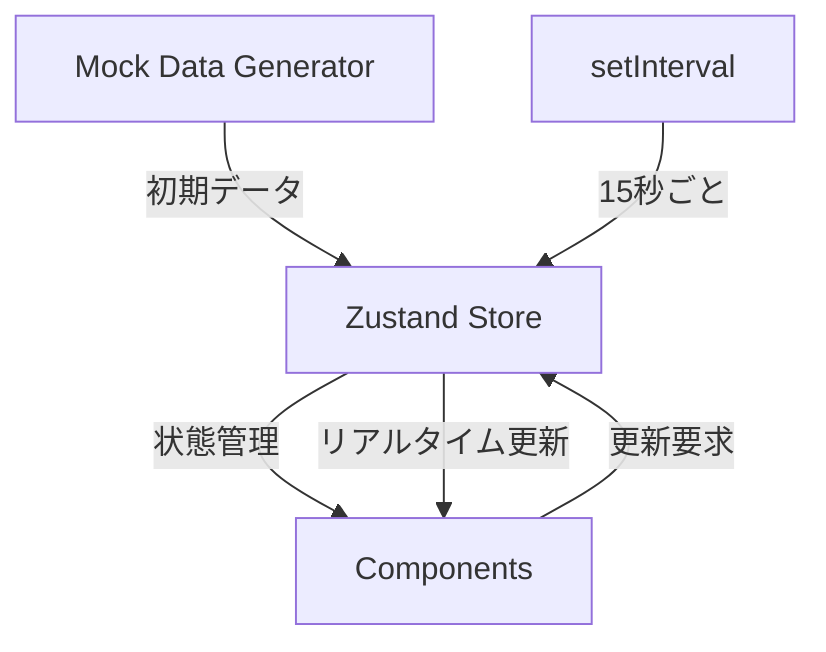

# システムアーキテクチャ概要

## 技術スタック

### フロントエンド
- **Next.js 14.2.4** - App Routerを使用
- **TypeScript** - 型安全性の確保
- **Tailwind CSS** - ユーティリティファーストCSS
- **Framer Motion** - アニメーション
- **Recharts** - データビジュアライゼーション
- **Zustand** - 状態管理

## ディレクトリ構造

```
hanshin/
├── app/                    # Next.js App Router
│   ├── page.tsx           # ホーム画面
│   ├── manufacturing/     # 機械稼働モニター
│   ├── production/        # スケジュール管理
│   └── management/        # KPIダッシュボード
├── src/
│   ├── components/        # UIコンポーネント
│   │   ├── machines/      # 機械関連
│   │   ├── schedules/     # スケジュール関連
│   │   ├── charts/        # グラフ関連
│   │   ├── layout/        # レイアウト
│   │   └── ui/           # 基本UI部品
│   ├── lib/              # ユーティリティ
│   ├── store/            # Zustand store
│   └── types/            # TypeScript型定義
└── docs/                 # ドキュメント
```

## データフロー



## 主要コンポーネント

### 1. MachineGrid
- 150台の機械を10×15のグリッドで表示
- 各機械の状態をリアルタイム更新

### 2. MachineTimeline（新規追加）
- 機械の稼働履歴を時系列で表示
- 状態変更の追跡と停止理由の表示
- タイムライン形式のUI

### 3. ScheduleBoard
- ドラッグ&ドロップ対応
- 機械別レーン表示

### 4. KPIDashboard
- 複数のグラフコンポーネントを統合
- Rechartsでデータビジュアライゼーション

### 5. Sidebar（新規追加）
- 左固定のナビゲーション
- アクティブ状態のアニメーション
- システム情報表示

## 状態管理設計

### Zustand Store構造
```typescript
interface MachineStore {
  machines: Machine[]
  schedules: Schedule[]
  logs: MachineLog[]
  updateMachineStatus: () => void
  updateScheduleProgress: () => void
  initializeData: () => void
}
```

## パフォーマンス考慮事項

1. **大量データの表示**
   - 150台の機械を効率的にレンダリング
   - 必要に応じてReact.memoを使用

2. **リアルタイム更新**
   - setIntervalで15秒ごとに状態更新
   - 必要な部分のみ再レンダリング

3. **アニメーション**
   - Framer Motionでスムーズな遷移
   - will-changeプロパティの適切な使用